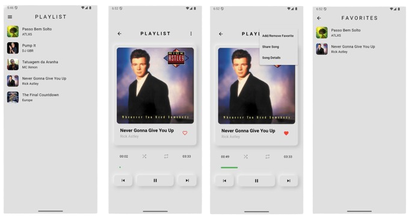

# Music App - Flutter Homework

<p align="center">
    
    <h1 align="center">Music App - Flutter homework project for ICM classes</h1>
    <p align="center">
        
    </p>
    <p align="center">
        
    </p>
</p>
<hr/>

## About the project
This is the flutter homework project for the ICM classes. The goal of this project is to create a simple app using Flutter. The Music App is built using Flutter and Dart, and it uses the `audioplayers` package to play music. The app has a simple UI that allows users to view their playlist and play music. The app also has a simple settings page that allows users to change the theme of the app.

## How to run the project
1. Clone the repository
```bash
git clone
```
2. Navigate to the project directory
```bash
cd musicapp
```
3. Install the dependencies
```bash
flutter pub get
```
4. Run the app
```bash
flutter run
```
6. Enjoy the app!


## How to clean the project
```bash
flutter clean
```

## How to build the project
```bash
flutter build apk
```

## Student
- **Name:** Abel Teixeira
- **Number:** 113655